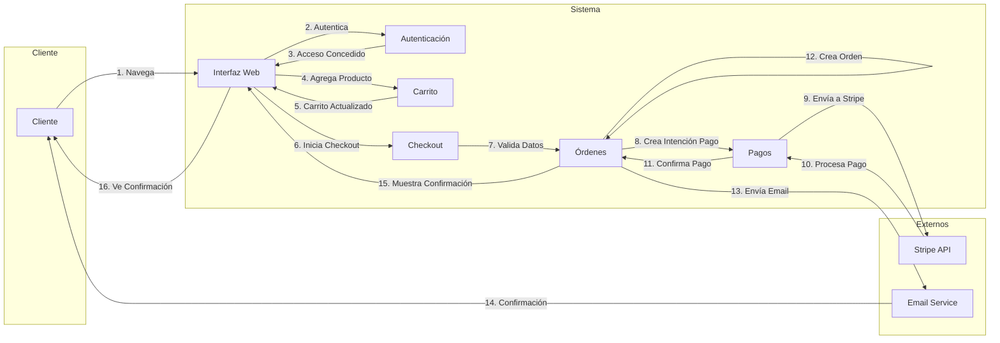
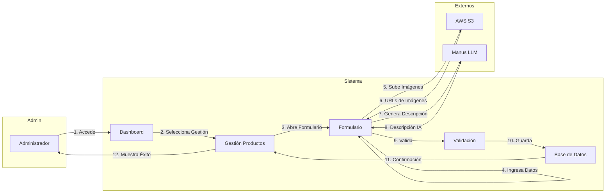
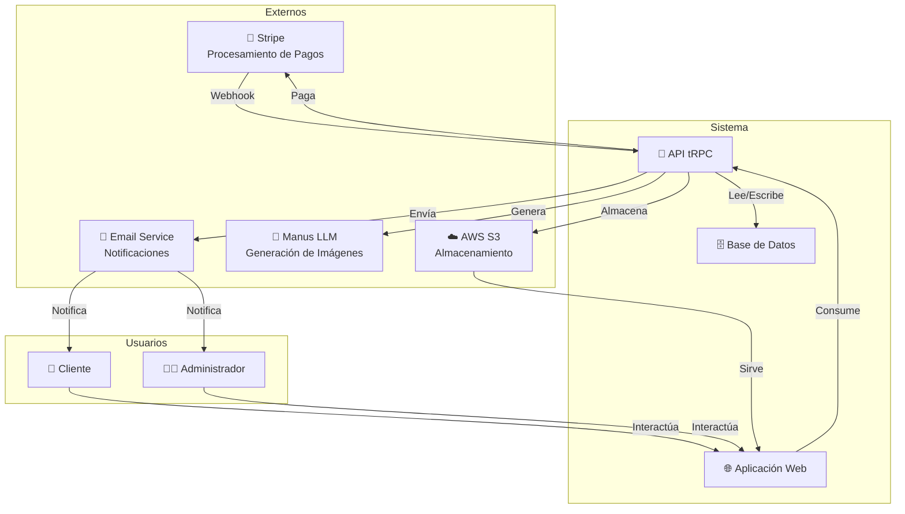

# Diagrama de Casos de Uso - Zapatillas JyR

## 1. Diagrama General de Casos de Uso

```mermaid
graph TB
    subgraph Actores
        C["👤 Cliente"]
        A["👨‍💼 Administrador"]
        S["🔐 Sistema Stripe"]
        E["📧 Sistema Email"]
    end
    
    subgraph CasosCliente["Casos de Uso - Cliente"]
        UC1["Explorar Catálogo"]
        UC2["Filtrar Productos"]
        UC3["Buscar Productos"]
        UC4["Ver Detalle Producto"]
        UC5["Agregar al Carrito"]
        UC6["Gestionar Carrito"]
        UC7["Autenticarse"]
        UC8["Ver Perfil"]
        UC9["Ver Historial"]
        UC10["Checkout"]
        UC11["Pagar"]
        UC12["Confirmación"]
    end
    
    subgraph CasosAdmin["Casos de Uso - Administrador"]
        UC13["Gestionar Productos"]
        UC14["Crear Producto"]
        UC15["Editar Producto"]
        UC16["Eliminar Producto"]
        UC17["Actualizar Stock"]
        UC18["Ver Pedidos"]
        UC19["Actualizar Estado"]
        UC20["Generar Imágenes IA"]
        UC21["Ver Estadísticas"]
    end
    
    C --> UC1
    C --> UC2
    C --> UC3
    C --> UC4
    C --> UC5
    C --> UC6
    C --> UC7
    C --> UC8
    C --> UC9
    C --> UC10
    C --> UC11
    C --> UC12
    
    A --> UC13
    A --> UC14
    A --> UC15
    A --> UC16
    A --> UC17
    A --> UC18
    A --> UC19
    A --> UC20
    A --> UC21
    
    UC11 --> S
    UC12 --> E
    UC19 --> E
```



## 2. Diagrama Detallado - Compra de Producto



## 3. Diagrama Detallado - Gestión de Productos (Admin)



## 4. Casos de Uso Principales con Extensiones

### 4.1 Caso de Uso: Compra de Producto

```
┌─────────────────────────────────────────────────────────────┐
│ Caso de Uso: Compra de Producto                             │
├─────────────────────────────────────────────────────────────┤
│ Actor Principal: Cliente                                    │
│ Precondición: Cliente está autenticado                      │
│ Postcondición: Orden creada, pago procesado                 │
├─────────────────────────────────────────────────────────────┤
│ Flujo Principal:                                            │
│ 1. Cliente navega al catálogo                               │
│ 2. Sistema muestra productos                                │
│ 3. Cliente busca o filtra productos                         │
│ 4. Sistema muestra resultados                               │
│ 5. Cliente selecciona un producto                           │
│ 6. Sistema muestra detalles                                 │
│ 7. Cliente selecciona talla y cantidad                      │
│ 8. Cliente agrega al carrito                                │
│ 9. Sistema actualiza carrito                                │
│ 10. Cliente procede al checkout                             │
│ 11. Sistema muestra formulario de envío                     │
│ 12. Cliente ingresa datos de envío                          │
│ 13. Sistema valida datos                                    │
│ 14. Sistema muestra resumen de compra                       │
│ 15. Cliente revisa y confirma                               │
│ 16. Cliente realiza pago                                    │
│ 17. Sistema crea intención de pago con Stripe              │
│ 18. Cliente completa pago en Stripe                         │
│ 19. Stripe confirma pago                                    │
│ 20. Sistema crea orden                                      │
│ 21. Sistema envía email de confirmación                     │
│ 22. Sistema muestra página de confirmación                  │
├─────────────────────────────────────────────────────────────┤
│ Flujos Alternativos:                                        │
│ A1 (Paso 3): Producto sin stock                             │
│    - Sistema muestra "Producto agotado"                     │
│    - Caso de uso termina                                    │
│ A2 (Paso 12): Datos de envío inválidos                      │
│    - Sistema muestra errores de validación                  │
│    - Cliente corrige datos                                  │
│    - Continúa en paso 13                                    │
│ A3 (Paso 18): Pago rechazado                                │
│    - Stripe rechaza pago                                    │
│    - Sistema muestra error                                  │
│    - Cliente puede reintentar                               │
│ A4 (Paso 16): Cliente cancela compra                        │
│    - Sistema limpia carrito                                 │
│    - Caso de uso termina                                    │
├─────────────────────────────────────────────────────────────┤
│ Extensiones:                                                │
│ E1: Aplicar código de descuento                             │
│ E2: Seleccionar método de envío                             │
│ E3: Guardar dirección para futuras compras                  │
└─────────────────────────────────────────────────────────────┘
```

### 4.2 Caso de Uso: Gestión de Productos

```
┌─────────────────────────────────────────────────────────────┐
│ Caso de Uso: Gestión de Productos                           │
├─────────────────────────────────────────────────────────────┤
│ Actor Principal: Administrador                              │
│ Precondición: Admin está autenticado                        │
│ Postcondición: Producto creado/actualizado/eliminado        │
├─────────────────────────────────────────────────────────────┤
│ Flujo Principal (Crear):                                    │
│ 1. Admin accede al panel de administración                  │
│ 2. Sistema muestra dashboard                                │
│ 3. Admin selecciona "Gestionar Productos"                   │
│ 4. Sistema muestra lista de productos                       │
│ 5. Admin hace clic en "Crear Producto"                      │
│ 6. Sistema abre formulario de creación                      │
│ 7. Admin ingresa nombre, descripción, precio                │
│ 8. Admin selecciona categoría y marca                       │
│ 9. Admin ingresa tallas y stock                             │
│ 10. Admin sube imágenes                                     │
│ 11. Sistema carga imágenes a S3                             │
│ 12. Admin guarda el producto                                │
│ 13. Sistema valida datos                                    │
│ 14. Sistema crea producto en BD                             │
│ 15. Sistema muestra confirmación                            │
├─────────────────────────────────────────────────────────────┤
│ Flujo Alternativo (Editar):                                 │
│ 3. Admin selecciona producto de la lista                    │
│ 4. Sistema abre formulario con datos actuales               │
│ 5. Admin modifica campos necesarios                         │
│ 6. Admin guarda cambios                                     │
│ 7. Sistema actualiza producto en BD                         │
│ 8. Sistema muestra confirmación                             │
├─────────────────────────────────────────────────────────────┤
│ Flujo Alternativo (Eliminar):                               │
│ 3. Admin selecciona producto                                │
│ 4. Admin hace clic en "Eliminar"                            │
│ 5. Sistema pide confirmación                                │
│ 6. Admin confirma                                           │
│ 7. Sistema elimina imágenes de S3                           │
│ 8. Sistema elimina producto de BD                           │
│ 9. Sistema muestra confirmación                             │
├─────────────────────────────────────────────────────────────┤
│ Flujos de Error:                                            │
│ E1 (Paso 13): Validación fallida                            │
│    - Sistema muestra errores                                │
│    - Admin corrige datos                                    │
│    - Continúa en paso 12                                    │
│ E2 (Paso 11): Error al subir imágenes                       │
│    - Sistema muestra error                                  │
│    - Admin reintenta                                        │
└─────────────────────────────────────────────────────────────┘
```

## 5. Matriz de Relaciones entre Actores y Casos de Uso

| Caso de Uso | Cliente | Admin | Sistema |
|-------------|---------|-------|---------|
| Explorar Catálogo | ✓ | ✓ | - |
| Filtrar Productos | ✓ | ✓ | - |
| Buscar Productos | ✓ | ✓ | - |
| Ver Detalle | ✓ | ✓ | - |
| Agregar al Carrito | ✓ | - | - |
| Gestionar Carrito | ✓ | - | - |
| Autenticarse | ✓ | ✓ | - |
| Ver Perfil | ✓ | ✓ | - |
| Ver Historial | ✓ | - | - |
| Checkout | ✓ | - | - |
| Pagar | ✓ | - | ✓ (Stripe) |
| Confirmación | ✓ | - | ✓ (Email) |
| Gestionar Productos | - | ✓ | - |
| Ver Pedidos | - | ✓ | - |
| Actualizar Estado | - | ✓ | ✓ (Email) |
| Generar Imágenes IA | - | ✓ | ✓ (LLM) |
| Ver Estadísticas | - | ✓ | - |

## 6. Diagrama de Interacción entre Actores



## 7. Flujo de Datos en Casos de Uso Críticos

### 7.1 Flujo de Pago

```
Cliente
  ↓
Ingresa datos de pago
  ↓
Frontend valida
  ↓
Envía a Stripe Elements
  ↓
Stripe tokeniza
  ↓
Envía token al backend
  ↓
Backend crea Payment Intent
  ↓
Stripe procesa pago
  ↓
Webhook confirma
  ↓
Backend crea orden
  ↓
Envía email
  ↓
Muestra confirmación
  ↓
Cliente recibe confirmación
```

### 7.2 Flujo de Notificación

```
Admin crea orden
  ↓
Sistema crea registro en BD
  ↓
Sistema dispara evento
  ↓
Email Service recibe evento
  ↓
Genera plantilla de email
  ↓
Envía a admin
  ↓
Envía a cliente
  ↓
Usuarios reciben notificación
```

---

**Documento preparado por:** Equipo de Desarrollo  
**Fecha:** Diciembre 2025  
**Versión:** 1.0
