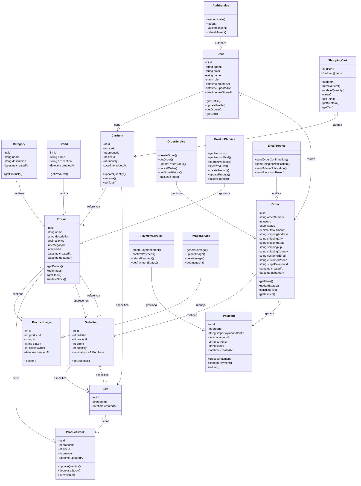
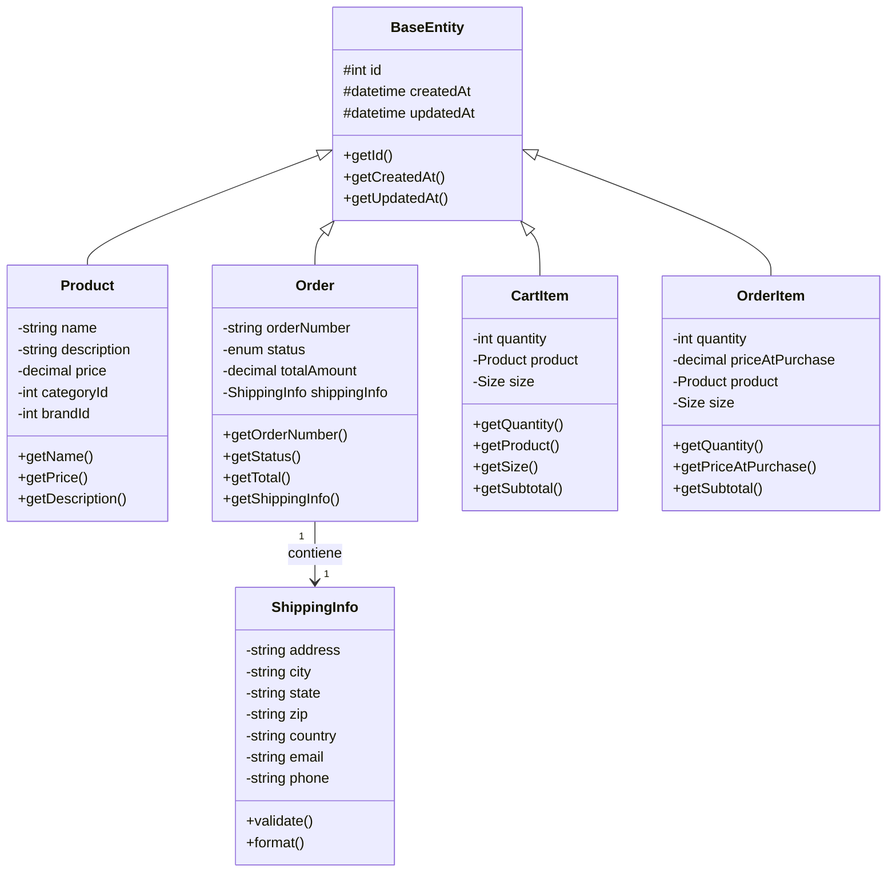
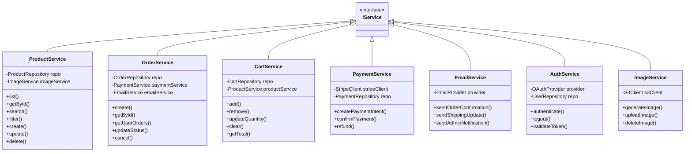
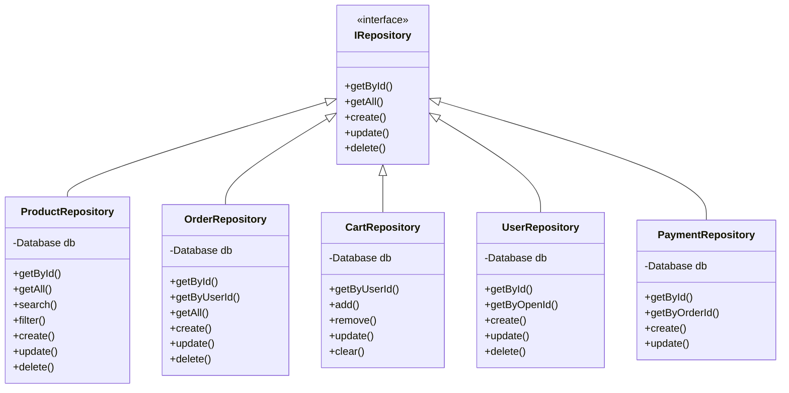
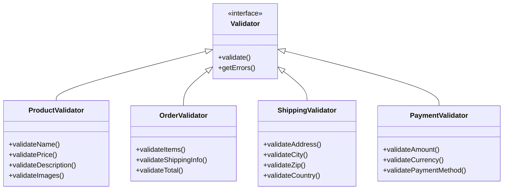
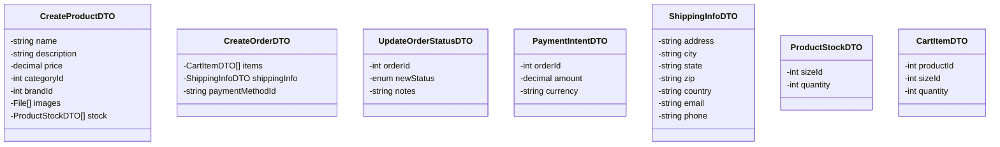
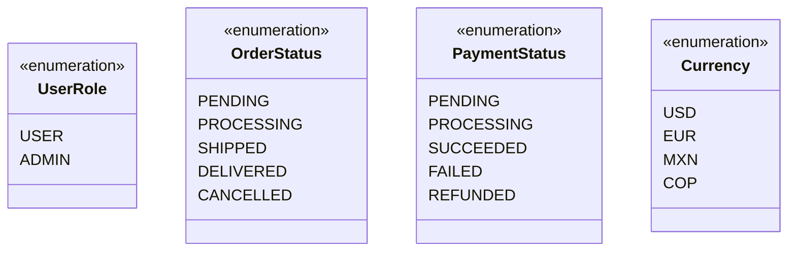

# Diagrama de Clases - Zapatillas JyR

## 1. Diagrama de Clases Principal



## 2. Diagrama de Clases - Entidades de Negocio



## 3. Diagrama de Clases - Servicios



## 4. Diagrama de Clases - Repositorios



## 5. Diagrama de Clases - Validación



## 6. Diagrama de Clases - DTOs (Data Transfer Objects)



## 7. Diagrama de Clases - Enums



## 8. Relaciones Complejas

### 8.1 Relación: Usuario → Carrito → Orden

```
User (1)
  ├─ ShoppingCart (1)
  │   └─ CartItem (*)
  │       ├─ Product (1)
  │       └─ Size (1)
  └─ Order (*)
      ├─ OrderItem (*)
      │   ├─ Product (1)
      │   └─ Size (1)
      └─ Payment (1)
```

### 8.2 Relación: Producto → Categoría, Marca, Stock

```
Product (1)
  ├─ Category (1)
  ├─ Brand (1)
  ├─ ProductImage (*)
  └─ ProductStock (*)
      └─ Size (1)
```

### 8.3 Relación: Orden → Pago → Stripe

```
Order (1)
  ├─ OrderItem (*)
  │   └─ Product (1)
  ├─ Payment (1)
  │   └─ Stripe (external)
  └─ ShippingInfo (1)
```

## 9. Patrones de Diseño Utilizados

| Patrón | Uso | Clase |
|--------|-----|-------|
| Repository | Acceso a datos | ProductRepository, OrderRepository |
| Service | Lógica de negocio | ProductService, OrderService |
| DTO | Transferencia de datos | CreateProductDTO, CreateOrderDTO |
| Factory | Creación de objetos | OrderFactory, PaymentFactory |
| Observer | Eventos | EmailService (escucha eventos de Order) |
| Strategy | Algoritmos de pago | PaymentService (Stripe, PayPal) |
| Singleton | Instancia única | Database, StripeClient |

---

**Documento preparado por:** Equipo de Desarrollo  
**Fecha:** Diciembre 2025  
**Versión:** 1.0
