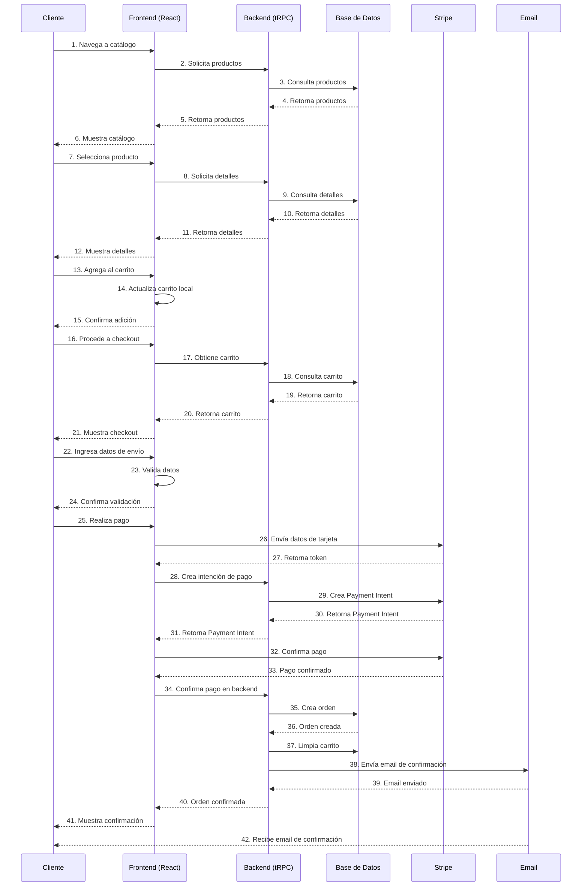
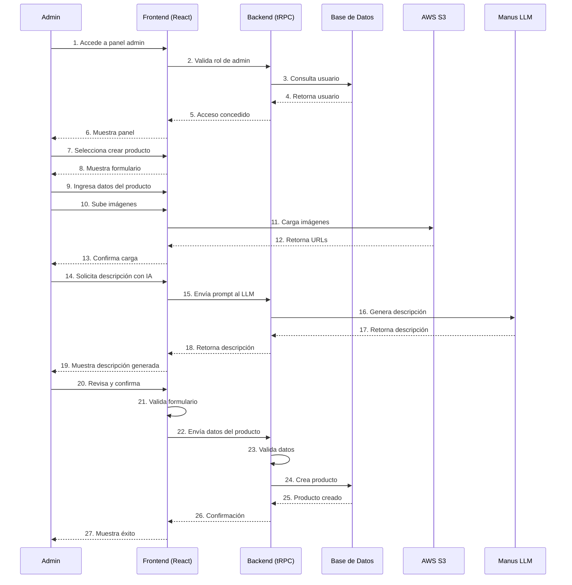
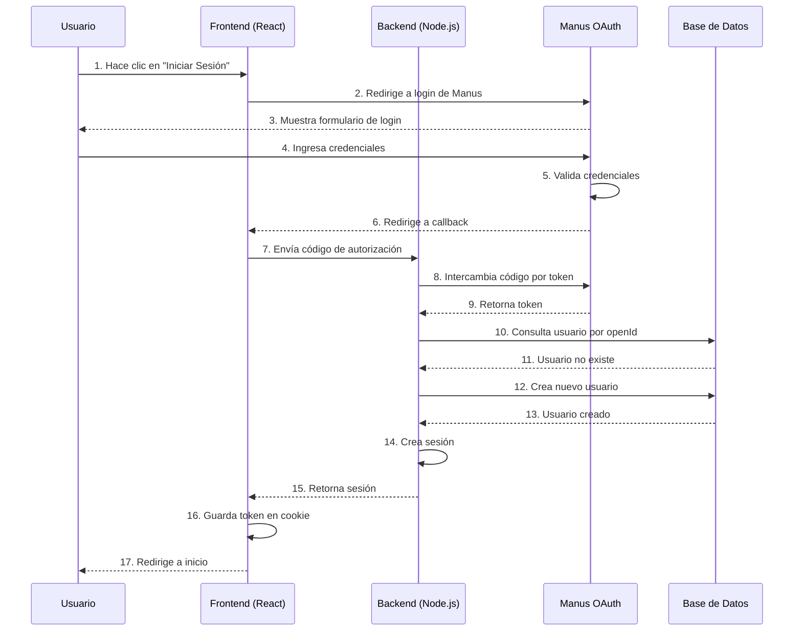
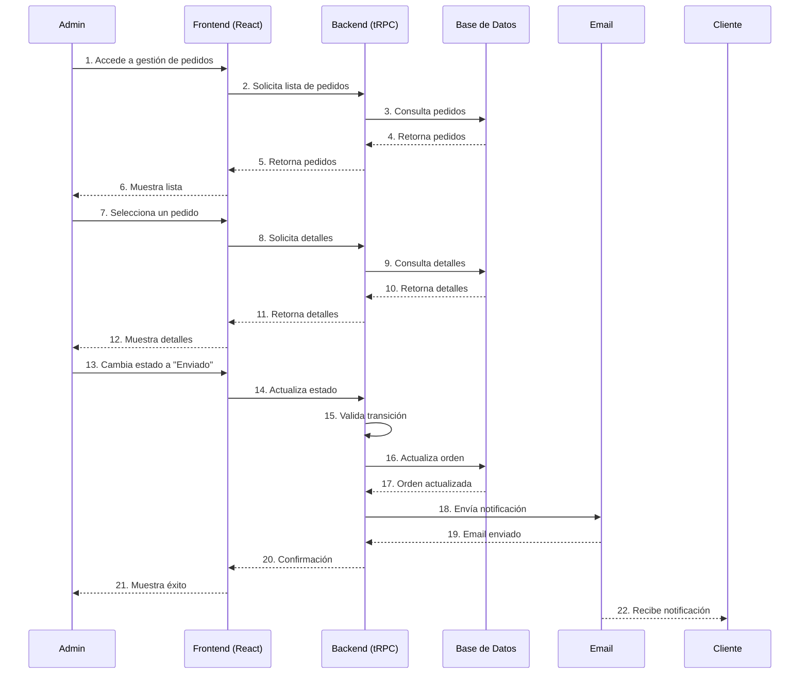
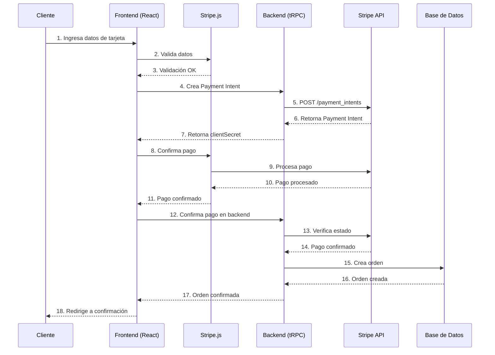
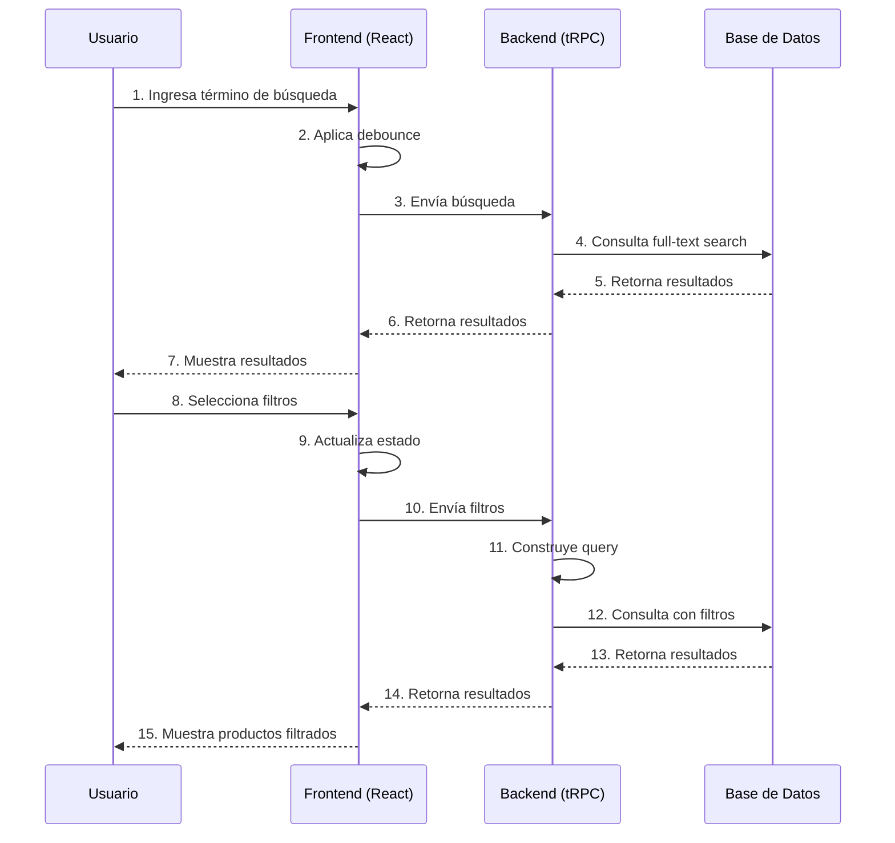
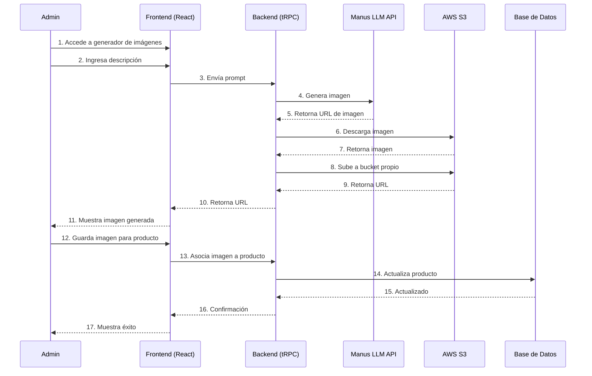
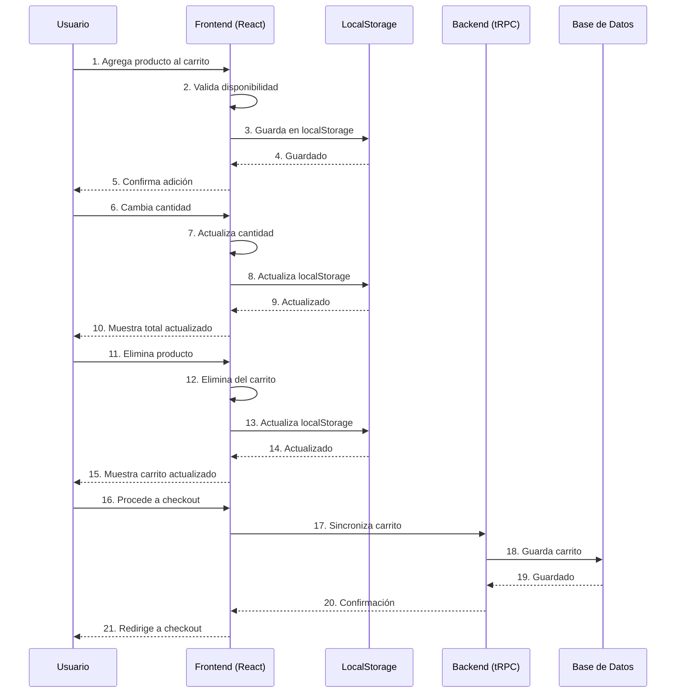
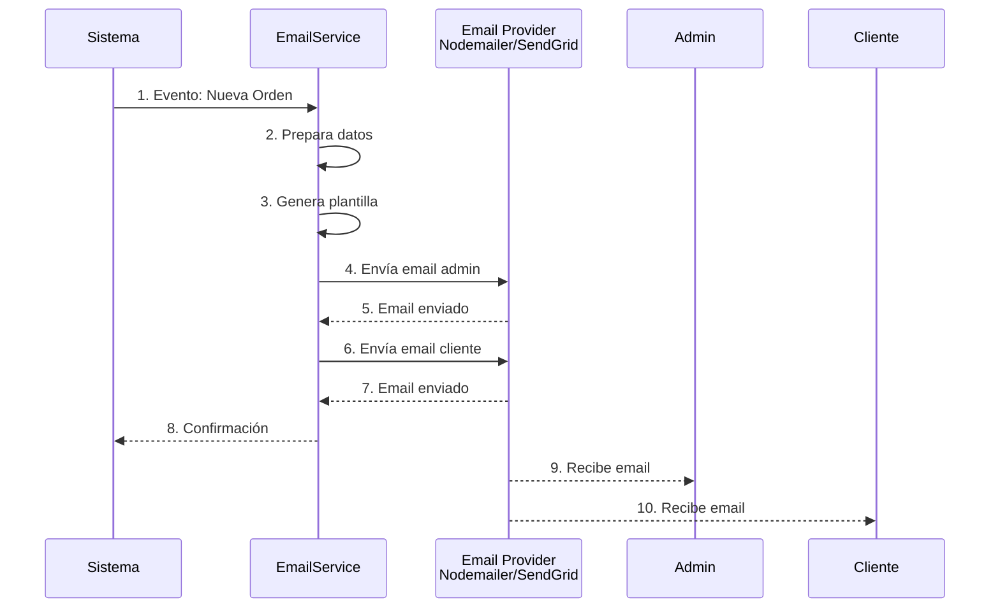
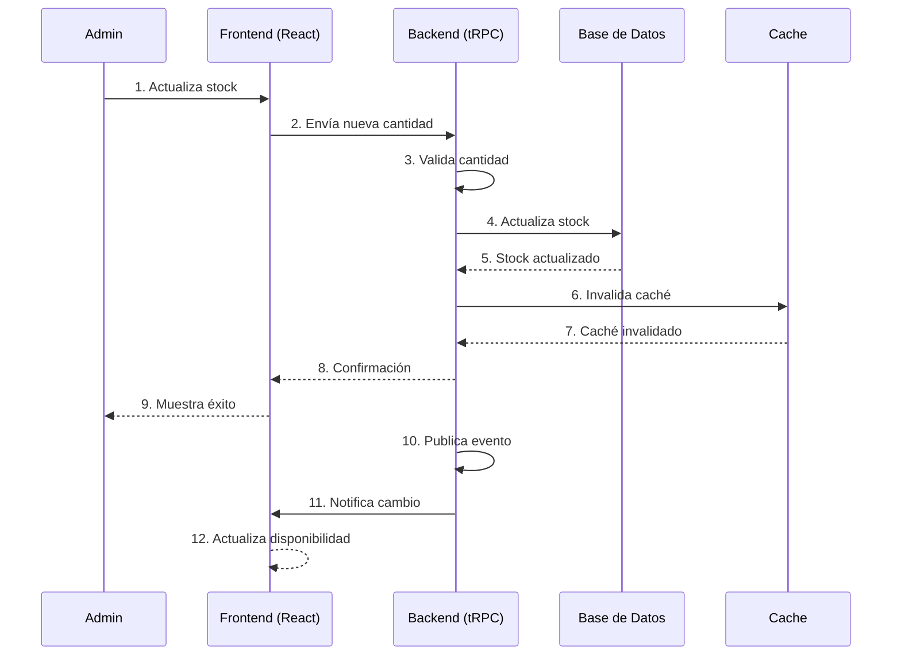

# Diagrama de Secuencia - Zapatillas JyR

## 1. Secuencia: Compra de Producto

## 2. Secuencia: Gestión de Productos (Admin)

## 3. Secuencia: Autenticación OAuth

## 4. Secuencia: Actualización de Estado de Orden

## 5. Secuencia: Procesamiento de Pago con Stripe

## 6. Secuencia: Búsqueda y Filtrado de Productos

## 7. Secuencia: Generación de Imágenes con IA

## 8. Secuencia: Carrito de Compras

## 9. Secuencia: Notificación por Email

## 10. Secuencia: Sincronización de Stock

---

## Leyenda de Símbolos

| Símbolo | Significado |
|---------|------------|
| → | Solicitud/Mensaje |
| ← | Respuesta |
| ↔ | Comunicación bidireccional |
| ✓ | Validación exitosa |
| ✗ | Validación fallida |

---

**Documento preparado por:** Equipo de Desarrollo  
**Fecha:** Diciembre 2025  
**Versión:** 1.0
